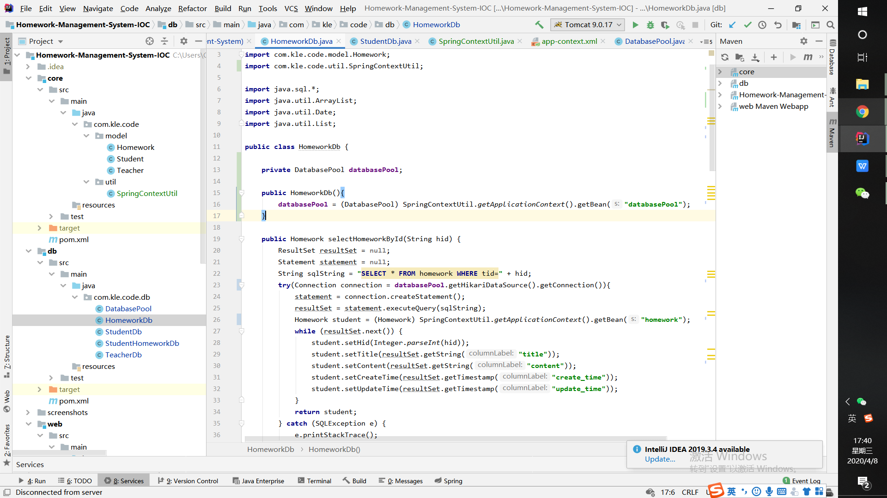

### 开发作业管理系统

#### 该项目地址：[项目地址](https://github.com/kelekle/homework)
#### 具体设计开发见以下博客
#### csdn: [博客链接](https://blog.csdn.net/qq_41446852/article/details/104831251) ###
#### github page: [博客链接](https://kelekle.github.io/2020/03/17/JAVAEE-02%20%E5%81%9A%E4%B8%80%E4%B8%AA%E4%BD%9C%E4%B8%9A%E7%AE%A1%E7%90%86%E7%B3%BB%E7%BB%9F%E2%80%94jsp+servlet+layui/)  

****
### 作业管理系统 （改造为Maven项目+优化） 

### 该项目地址：[项目地址](https://github.com/kelekle/homework_management_system)
##### csdn: [博客链接](https://blog.csdn.net/qq_41446852/article/details/104831251)
##### github page: [博客链接](https://kelekle.github.io/2020/03/17/JAVAEE-02%20%E5%81%9A%E4%B8%80%E4%B8%AA%E4%BD%9C%E4%B8%9A%E7%AE%A1%E7%90%86%E7%B3%BB%E7%BB%9F%E2%80%94jsp+servlet+layui/)  
优化内容：
1. 改造为 Maven 项目
2. 采用 Project/module 模式
3. 使用 HikariCP 数据库连接池  

简要介绍：  
1. db存放数据库相关类以及数据库连接池单例类
2. core存放相关model实体类
3. web存放servlet, filter, jsp等

****
### 作业管理系统 （使用 Spring MVC + 优化） 

### 该项目地址： [项目地址](https://github.com/kelekle/homework_management_system_springmvc)  
优化内容：
1. 添加springmvc依赖，app-context.xml的srpingmvc配置文件，修改web.xml,添加相关配置，并注册app-context.xml文件
2. 删除servlet包，添加controller包 
3. 删除filter包，添加interceptor包,并在app-context.xml中配置

简要介绍：  
1. controller 下存放路由相关处理
2. interceptor 下存放相关拦截器

****
#### 说明： 不好意思老师，之前不太清楚git可以记录历史版本，后面作业一直都用同一个仓库
### 作业管理系统 （使用 IOC + 优化） 

优化内容：
1. 使用IOC进行实例管理, 将原来app-context中的bean定义都改为注解
2. 使用@Autowired在构造器中自动装配,包括所有model下所有实例类(prototype)以及db下的DatabasePool(singleton)和所有Db类
2. 放弃自己写的单例DatabasePool,采用IOC管理,使用bean注册单例的DatabasePool(singleton)

3. 在core下新建一个util包，写了一个实现ApplicationContextAware接口的SpringContextUtil类，并在app-context.xml中注册，方便获取ApplicationContext

4. 使用：

5. 配置相关(详见web模块中的app-servlet.xml)
6. 将之前从req中取参改为@RequestParam

****
### 作业管理系统 （使用 AOP + 优化）
 
##### 提取service层， 添加切面， 使用AOP实现事务
1. 目前的逻辑中只有三个绑定的(即非一个)SQL语句构建成的事务，分别是a.删除学生(需要删除学生作业关系) b.删除作业(需要删除学生作业关系) c.布置作业(需要添加学生作业关系)
2. com.kle.code.aop下的TransactionManager(切点即对应service中的三个方法)，为三个事务添加切点，利用切面对三个事务进行实现:@Before 关闭自动提交 @AfterReturning 正常执行后事务提交 @AfterThrowing 异常后事务回滚
3. 从之前的controller中提取service层(service.impl包下实现)
4. 使用ConnectionUtils(db包)利用ThreadLocal获取当前线程的数据库连接用来使用(提交，回滚...)、关闭，方便在TransactionManager获取当前线程数据库连接操作

****
### 作业管理系统 （改为springboot项目）

1. 在pom文件中添加springboot相关依赖
2. 添加application.properties配置文件
3. 去除web.xml部分配置（包括对app-context, app-servlet的引用以及一些扫描等）
4. 添加config文件夹，设置springboot中的拦截器、默认路由、跨域配置等
5. 注：先吐槽下，不得不说springbooot使用jsp是真的费劲，需要添加好多依赖，这些我都在pom加了注释  
还有springboot的静态资源文件位置是在默认路径下去查找的 ，所以静态文件也得移到相应位置，另外对spring依赖部分做了一些小改进

****
### 作业管理系统 （使用jpa操作数据库）
1. 在pom文件中添加springboot以及jpa相关依赖
2. web模块下添加mapper_jpa文件夹，通过继承jpaRepository实现相关操作，并使用@Query完成其余操作，使用了分页
3. model下新建了pk文件夹主要放置复合主键
4. 将所有db模块的操作替换为jpa操作
5. 使用lombok简化代码
7. 注：因为是jpa操作，之前的aop无法获取到对应connection，所以把之前的aop事务注释掉

****
### 作业管理系统 （使用Mybatis操作数据库）

1. pom文件中添加myabtis相关依赖和mybatis-generator生成器插件，删除之前的jpa所有相关
1. resources下添加mybatis文件夹，放置sqlMapConfig.xml文件，设置myabtis一些配置信息，在app-context的sqlSessionFactory中引用
2. resources下mybatis文件夹添加generatorConfig.xml文件，主要用来根据数据库表自动生成mybatis的mapper映射文件，mapper文件生成后统一放置在resources下的mapper文件夹，配置完后在pom文件中插件部分的mybatis生成器中引用
3. 由于mybatis生成器只生成了基本增删改查代码，我在里面加入了一些别的要用到的sql
4. 创建dao层（全都是接口），配置mapper和dao层满足下面提到的要求，项目中就可以直接使用dao层接口进行操作
5. 替换之前的db层改为使用dao层接口

注（因为此处我之前踩了点坑，特此列出来）：
因此在配置mapper和dao层时会要求:
在mapper文件中namespace等于对应接口的全限定名；
接口中的方法名和mapper文件中的statement(<select>,<update>...标签)的id属性值一致;
接口中的方法输入值参数和mapper文件中statement的parameterType指定的类型一致。
接口中的方法的返回值类型和mapper文件中statement的resultType指定的类型一致。

